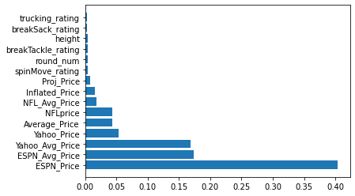

# Idea
1. Perform sentiment analysis during the off-season and pre-season to see how a player is performing before the draft occurs
    - Sentiment analysis based on Reddit fantasy football subreddit
    - Sentiment analysis based on Twitter pre-season performances [DONE]
2. Use historical data to generate a prediction of how these players will perform this season
3. Use other websites (i.e. ESPN, WalterFootball, etc.) and put these auction values into XGBoost?
    - Potentially use a previously-created CSV file that does so
4. Plug these outputs into a neural network for a final prediction
    - First, I want to predict average draft rankings but this is quite subjective
    - Two, I want to predict what their draft auction value will be.

# Initial Results (after Twitter Sentiment Analysis and Madden Ratings)

testing 
